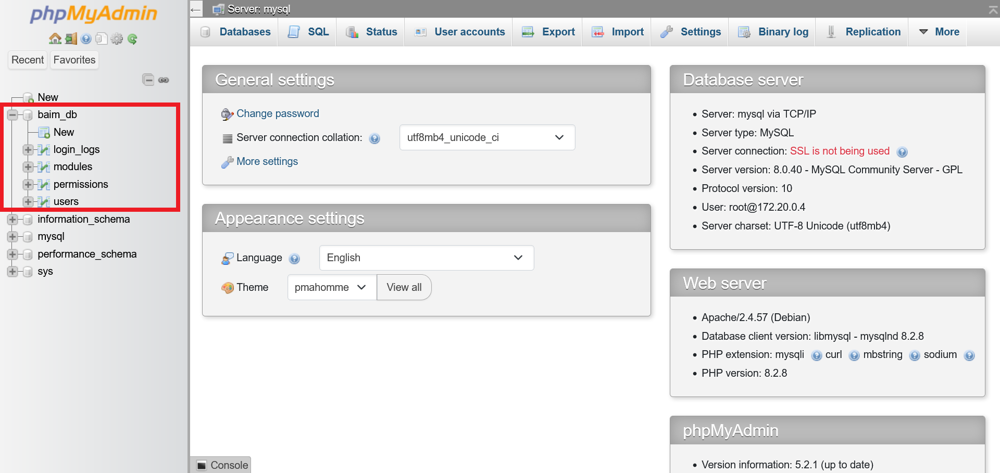
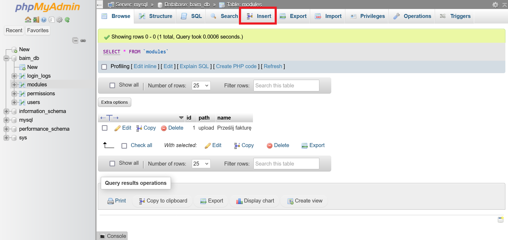
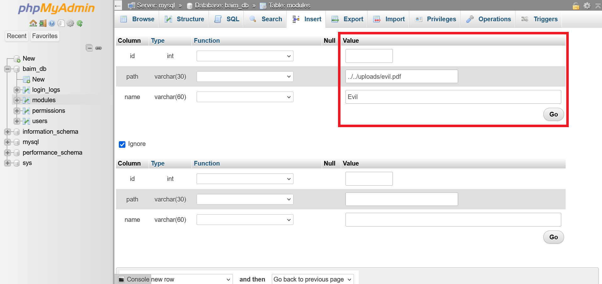
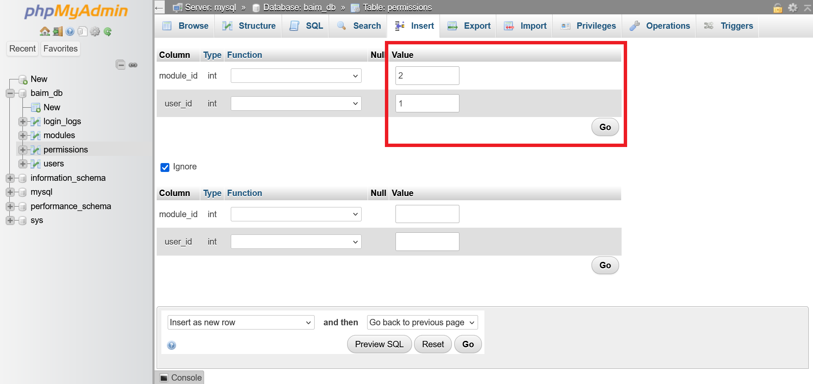
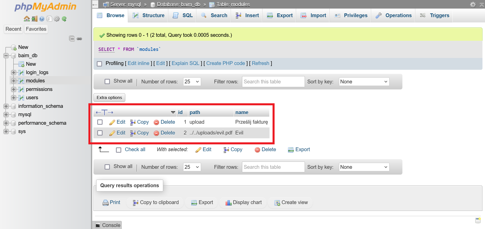
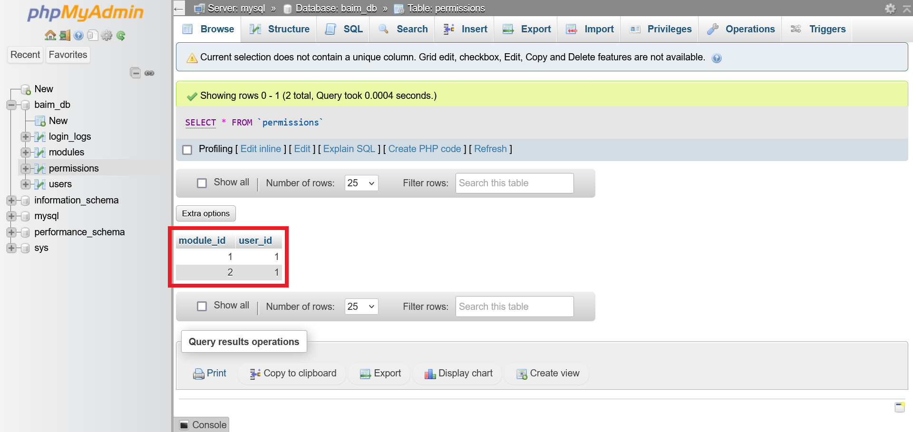

# Wykonanie [ROZWIĄZANIE]

## Metoda SQLi

Nie rozwodząc się za bardzo...

## PhpMyAdmin

Zalogować się do panelu (localhost:8081) \
Należy rozwinąć bazę danych **baim_db** \
Wybrać tabelę **modules**

Przyciskiem na górze przejść do zakładki **Insert**

Wpisać następujące wartości (nie trzeba id) i kliknąć GO

Następnie przejść do tabeli **permissions** i dodać dla użytkownika **baim** dostęp do modułu o id=2

Tabele powinny wyglądać tak:

Po odświeżeniu panelu testowanej aplikacji (localhost:8080), powinien pojawić się moduł o nazwie **evil**
